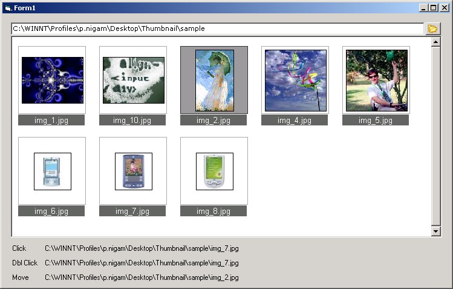

## Thumbnail Control \- OCX Source

### Description

With OCX Source Code.

This is a thumbnail active-x control, like the one in windows explorer. Displays images, while maintaing the aspect ratio. Just specify the path of the folder containing the images...

Events : mouseover, click, doubleclick

Menu : rightclick on the image. select zoom. the original image will be displayed. Press the (+) and (-) keys on the keypad to increase/decrease the image size in the zoom window.

I welcome bugs and/or suggestions.

Vote if you like .... not mandatory.
 
### More Info
 

             |
---                |---
**Submitted On**   |2004-04-29 12:39:28
**By**             |[Prateek Nigam](https://github.com/Planet-Source-Code/PSCIndex/blob/master/ByAuthor/prateek-nigam.md)
**Level**          |Advanced
**User Rating**    |4.5 (18 globes from 4 users)
**Compatibility**  |VB 6\.0
**Category**       |[OLE/ COM/ DCOM/ Active\-X](https://github.com/Planet-Source-Code/PSCIndex/blob/master/ByCategory/ole-com-dcom-active-x__1-29.md)
**World**          |[Visual Basic](https://github.com/Planet-Source-Code/PSCIndex/blob/master/ByWorld/visual-basic.md)
**Archive File**   |[Thumbnail\_1739224302004\.zip](https://github.com/Planet-Source-Code/prateek-nigam-thumbnail-control-ocx-source__1-53482/archive/master.zip)

